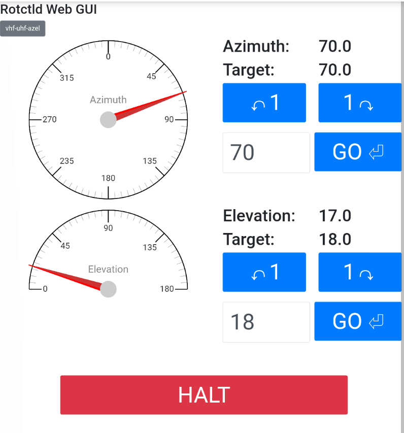

# Basic Rotctld Web GUI

This Flask application was forked from
https://github.com/bjorgan/rotctld-web-gui which was forked from
https://github.com/darksidelemm/rotctld-web-gui (Mark Jessop, 2018-07-07), with
the intention of adding support for multiple rotors and adapting it for the use
at the LA1K club station (https://github.com/bjorgan/rotctld-web-gui)

Changed to add the visual dial and tweak the behavior for use in the !WIRED Lab.

The app is intended to be easy to use from a mobile browser, e.g. from on the
roof.
Better desktop styling help wanted!





## Dependencies
* Python (3.x)
* Python Modules: flask, flask-socketio  (can obtain using pip)

## Configuration file

Uses a configuration file to specify rotors to connect to. Example:

```
[ROTOR1]
rotctld_host=10.42.0.100
rotctld_port=4533

[ROTOR2]
rotctld_port=4535

[ROTOR3]
rotctld_port=4537
```

Tries by default to look it up in `/usr/local/etc/rotors.conf`, should otherwise
be specified by argument `--config-file=PATH`. See `--help`.

Uses the same configuration file format as the system
specified in https://www.la1k.no/2017/09/15/unified-software-rotor-control-over-the-local-network/, https://github.com/la1k/rotorconfig.

## Usage:
* Start rotctld (refer rotctld documentation)
* `python rotatorgui.py`
* Navigate to http://localhost:5001/   (or equivalent IP)

Run `python rotatorgui.py --help` for command line options:
